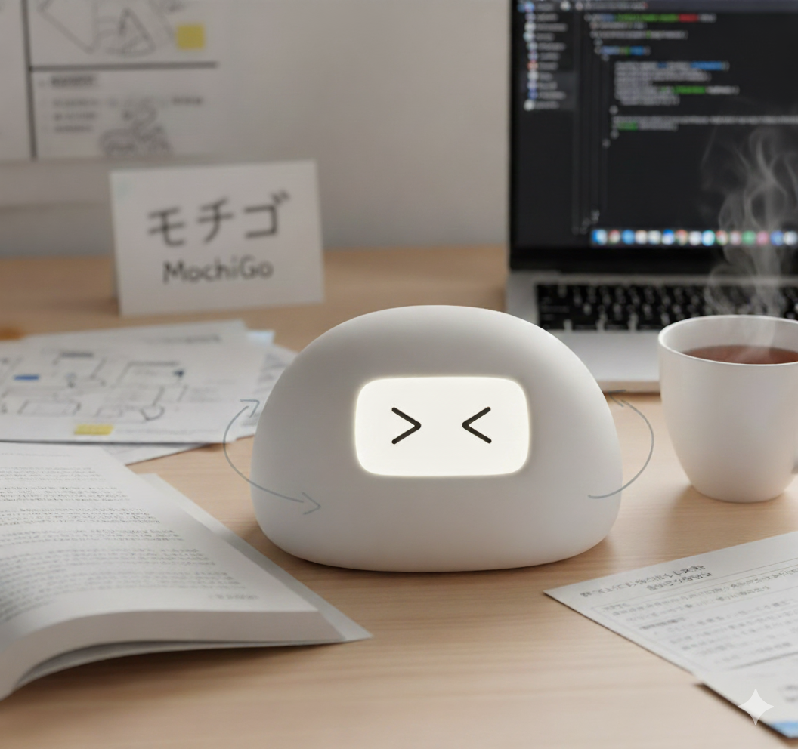

# MochiGo

  

An interactive English teaching robot powered by speech recognition, LLM capabilities, and real-time feedback.

## Overview
MochiGo is a Raspberry Pi-based educational robot designed to help users improve their English pronunciation and conversation skills. The system combines cutting-edge AI technologies with intuitive robot interactions to create an engaging learning experience.

## Key Features
- **Real-time Speech Recognition**: Captures and processes user speech using Vosk and WebRTC VAD
- **AI-Powered Responses**: Integrates with Ollama for intelligent conversation and feedback
- **Animated Feedback**: Uses OLED displays and servo-controlled eyes to provide visual feedback
- **Microphone Array**: Omni-directional audio input with multiple microphone support
- **Motor Control**: Servo motors for expressive robot movements and reactions

## Project Structure
- **rsp-scripts/**: Main Raspberry Pi scripts for robot control, audio processing, and display management
- **esp-client/**: ESP8266/ESP32 client for wireless communication
- **esp-server/**: Server-side processing for speech-to-text and audio handling
- **RPi-LLM/**: Language model integration for intelligent responses
- **mic.py**: Central microphone configuration

## Dependencies
All required Python libraries are listed in `Docs/requirements.txt` and can be installed with the setup scripts.
